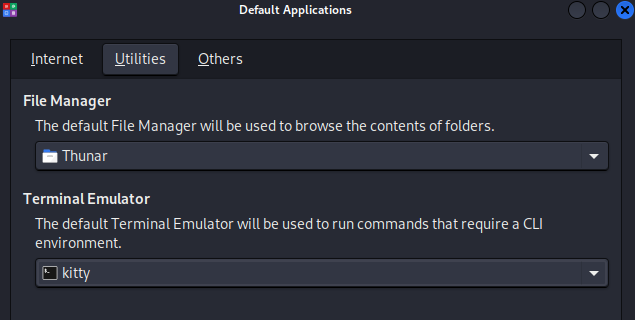
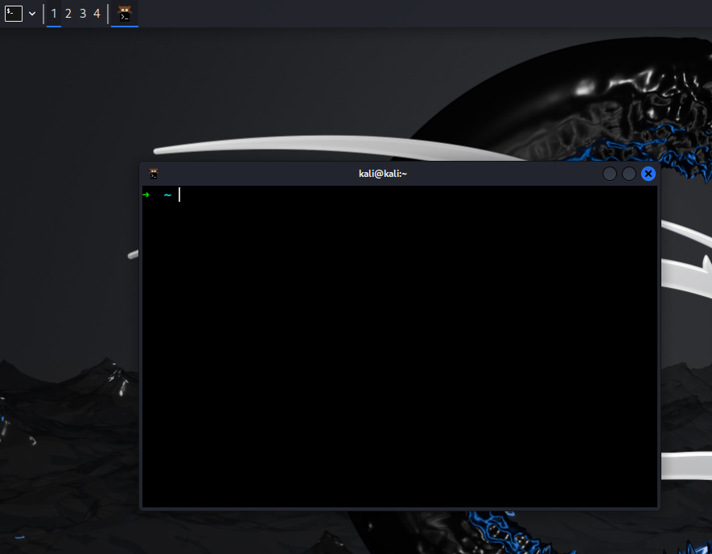
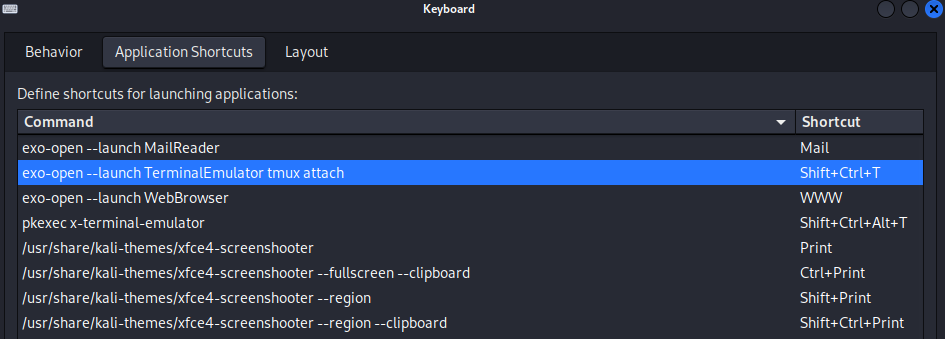
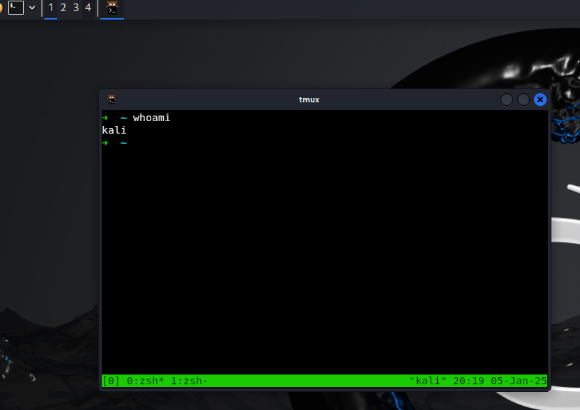
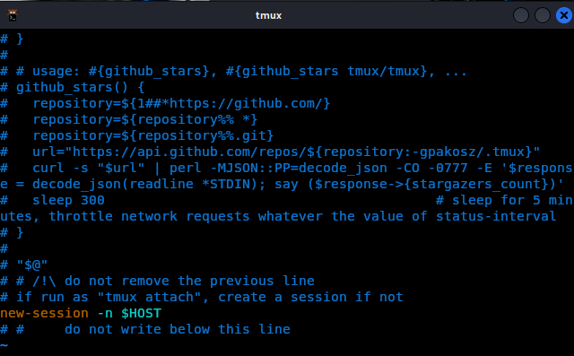

## 모의해킹에 필요한 셋업

이번 포스트에선 모의해킹 작업에 필요한 필수 환경설정에 대해 다룹니다. 

## 해당 포스트가 도움이 되는 사람들 목록
- 모의해커를 처음 배우시는 분들
- 현직 모의해커

## Prerequsuite

### Hardware

### Software

### Applicaiton

### 이쁜 재활용품(쓰레기) SETUP

ZSH 셉업 

쉘 고르기:
https://ohmyz.sh/#install
`sh -c "$(curl -fsSL https://raw.githubusercontent.com/ohmyzsh/ohmyzsh/master/tools/install.sh)`

Terminal Emulationr:

https://sw.kovidgoyal.net/kitty/conf/

Kitty 설치
https://sw.kovidgoyal.net/kitty/binary/#binary-install
`curl -L https://sw.kovidgoyal.net/kitty/installer.sh | sh /dev/stdin`

Kali Termainl Emulator 디폴트 셋업

ZSH 디폴트 쉘로 셋업

`➜  ~ chsh -s $(which zsh)`

https://linkarzu.com/posts/macos/alacritty-to-kitty/

## Tmux + Kitty (Terminal Emulator) Integration

